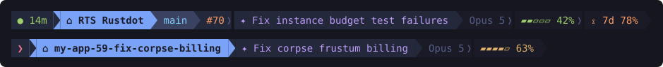

# claude-pane-statusline

A statusline for people who run **several Claude Code sessions in split panes** and can't
tell which pane is which. Each pane labels itself with what it's working on and whether
it needs your attention:



```
 ● │ ⌂ my-repo │  main │ #70 │ ✦ Fix instance budget test failures │ Opus 5 │ ▰▰▱▱▱ 42% │ ⧖ 7d 78%
```

| Segment | Meaning |
|---|---|
| `●` / `❯` | Green dot: Claude is working. Bold red caret: the pane is **waiting on you** — a finished turn, a permission prompt, or a question. |
| `⌂ my-repo` | Folder / worktree the session runs in (blue = git repo, grey = plain folder). |
| ` main` | Git branch. Hidden when the folder name already contains it (common for worktrees). |
| `#70` | Claimed issue chip (optional, see below). |
| `✦ title` | **Live task label** — a ≤6-word summary of the session's prompt history, regenerated by Haiku after every substantive prompt. The `✦` pulses `✧ ✦ ✶ ✻ ✽` while a new title is being generated. |
| `Opus 5` | Model. |
| `▰▰▱▱▱ 42%` | Context usage — green, yellow at 60%, red at 80%. |
| `⧖ 7d 78%` | Rate-limit windows (5h/7d) — only shown at ≥75%, red at 90%. |

Task labels are generated with `claude -p --model haiku`, billed to whatever login your
`claude` CLI has (a Claude subscription works — no API key needed). One small call per
substantive prompt. If the call fails, the previous label just stays.

Colors are Tokyo Night truecolor; the palette is a single table at the top of
`statusline.js` if you want to reskin it.

## Requirements

- `node` and `git` on PATH
- The `claude` CLI installed and logged in (only needed for the Haiku task labels —
  without it everything else still works and labels fall back to the built-in session name)
- A terminal with truecolor and powerline glyphs (Windows Terminal with Cascadia, or any
  Nerd Font terminal)

## Setup

**Easiest: let Claude do it.** Clone this repo, open Claude Code, and say:

> install the statusline from this repo per the README

The "Instructions for the installing agent" section below is written for it to follow.

**Manual setup:**

1. Copy `statusline.js`, `session-task.js`, and `session-state.js` into `~/.claude/`
   (they find each other via `__dirname` — nothing inside them needs editing).

2. Merge the following into `~/.claude/settings.json`, replacing `<HOME>` with your real
   home directory as an absolute path. Preserve anything already in the file — in
   particular, if you already have `hooks`, append these entries to each event's array:

   ```json
   {
     "statusLine": {
       "type": "command",
       "command": "node \"<HOME>/.claude/statusline.js\"",
       "refreshInterval": 1
     },
     "hooks": {
       "UserPromptSubmit": [
         { "hooks": [
           { "type": "command", "command": "node \"<HOME>/.claude/session-task.js\"", "async": true, "timeout": 90 },
           { "type": "command", "command": "node \"<HOME>/.claude/session-state.js\" working", "async": true, "timeout": 10 }
         ] }
       ],
       "PostToolUse":  [ { "hooks": [ { "type": "command", "command": "node \"<HOME>/.claude/session-state.js\" working", "async": true, "timeout": 30 } ] } ],
       "Stop":         [ { "hooks": [ { "type": "command", "command": "node \"<HOME>/.claude/session-state.js\" waiting", "async": true, "timeout": 10 } ] } ],
       "Notification": [ { "hooks": [ { "type": "command", "command": "node \"<HOME>/.claude/session-state.js\" waiting", "async": true, "timeout": 10 } ] } ],
       "SessionEnd":   [ { "hooks": [ { "type": "command", "command": "node \"<HOME>/.claude/session-state.js\" clear", "async": true, "timeout": 10 } ] } ]
     }
   }
   ```

3. Restart your Claude Code sessions (or open `/hooks` once in each running one). The
   statusline itself appears without a restart; the hooks need one.

## How the pieces fit

- **`statusline.js`** renders the line. Claude Code pipes it session JSON on every
  refresh; it does one `git rev-parse` for the branch and reads the tiny state files below.
- **`session-task.js`** runs on every prompt you submit (async, so you never wait on it).
  It keeps your last 20 substantive prompts per session in
  `~/.claude/session-tasks/<id>.history`, asks Haiku for a ≤6-word title for the whole
  arc (weighted to recent prompts), and writes it to `<id>.txt`. Prompts starting with
  `/` or shorter than 15 characters never change the label.
- **`session-state.js`** tracks attention state: prompt submitted or tool completed →
  `working`; turn finished or notification (permission prompt, question) → `waiting`;
  session ended → state cleared. `PostToolUse → working` is what turns a pane green again
  after you approve a permission.
- State lives in `~/.claude/session-tasks/` (`.txt` label, `.history`, `.state`,
  `.pending` spinner marker, `.issue`); files older than 7 days are pruned automatically.
- The summarizer child process sets `RTS_TASK_SUMMARIZER`, which makes all these hooks
  exit immediately — that guard prevents infinite hook recursion. Don't remove it.

## Issue chip (optional)

If a tool call in the session runs `issue.ps1 claim <n>` (an issue-claiming convention
from the repo this was built in), the pane pins that issue: an orange `#n` chip appears,
`gh` fetches the title, and Haiku titles anchor to that issue until `issue.ps1 done <n>`.
If your repo has no such script this simply never triggers — or adapt the regex in
`session-state.js` to your own claim command.

## Tuning

- `refreshInterval: 1` re-runs the statusline every second (~100 ms of node+git per pane)
  so the spinner animates and gauges stay fresh on idle panes. Raise it to `2` if you run
  many panes on a weak machine.
- Label length is capped at 60 chars (trimmed at a word boundary at generation time).
- Testing from PowerShell 5.1? Its pipes prepend a BOM; the scripts strip it deliberately.

## Leaked render processes (Windows)

Two ways a render's node process can outlive its ~200 ms job, found after 1,083 of them
accumulated holding 33 GB:

- The script used to read stdin with `fs.readFileSync(0)`, which blocks forever if the
  pipe never delivers EOF — and no timer can rescue a blocked sync call. Fixed:
  `statusline.js` now reads stdin async with a 500 ms deadline and exits explicitly.
- Claude Code's spawner can abandon a render child it created `CREATE_SUSPENDED` — the
  process never executes a single line of JS (one suspended thread, 0 CPU, ~30 MB), so no
  script-side fix can help. `statusline-reaper.ps1` culls any statusline node older than
  60 s (healthy renders exit in well under a second). Register it as a scheduled task:

  ```powershell
  $action = New-ScheduledTaskAction -Execute 'powershell.exe' `
    -Argument '-NoProfile -WindowStyle Hidden -ExecutionPolicy Bypass -File "C:\Users\YOU\.claude\statusline-reaper.ps1"'
  $trigger = New-ScheduledTaskTrigger -Once -At (Get-Date).AddMinutes(1) -RepetitionInterval (New-TimeSpan -Minutes 5)
  $settings = New-ScheduledTaskSettingsSet -Hidden -AllowStartIfOnBatteries -DontStopIfGoingOnBatteries `
    -MultipleInstances IgnoreNew -ExecutionTimeLimit (New-TimeSpan -Minutes 2)
  Register-ScheduledTask -TaskName 'StatuslineReaper' -Action $action -Trigger $trigger -Settings $settings
  ```

## Instructions for the installing agent

You are installing three self-contained node scripts and registering them in the user's
**user-level** `~/.claude/settings.json`. Nothing here touches a project.

1. Check the requirements above. If `claude -p` is unavailable, install anyway and tell
   the user labels will fall back to the built-in session name.
2. Copy the three scripts into `~/.claude/`.
3. Back up `~/.claude/settings.json`, then merge the snippet from "Manual setup" —
   read the existing file first and preserve everything in it, especially existing
   `hooks` entries (append to an event's array, never replace it). Use the user's real
   home directory, absolute, in the platform's own path style.
4. Verify before declaring success:
   - Pipe `{"model":{"display_name":"Test"},"workspace":{"current_dir":"<any git repo>"}}`
     into `node ~/.claude/statusline.js` → an ANSI line naming the repo folder and branch.
   - Pipe `{"session_id":"t1","prompt":"add a settings page with theme toggle"}` into
     `node ~/.claude/session-task.js` → within ~15 s `~/.claude/session-tasks/t1.txt`
     contains a short title (proves the `claude -p` call works).
   - Pipe `{"session_id":"t1"}` into `node ~/.claude/session-state.js waiting` →
     `~/.claude/session-tasks/t1.state` contains `waiting`.
   - Delete the `t1.*` test files and confirm `settings.json` still parses as JSON.
5. Tell the user: restart claude sessions (or `/hooks` once in each) to activate.

## Extending it

The whole system communicates through plain files in `~/.claude/session-tasks/`, keyed by
session id — that directory **is** the API. Anything that writes these files drives the
statusline; anything can read them:

| File | Contents | Effect |
|---|---|---|
| `<id>.txt` | one line of text | The `✦` label, shown verbatim. Write it directly to bypass Haiku entirely. |
| `<id>.issue` | e.g. `#123 fix the flaky test` | Pins context: the leading `#123` renders as the orange chip, and the full text anchors every future Haiku title until the file is deleted. |
| `<id>.history` | one prompt/context line per row | What Haiku summarizes. Append lines to feed extra context into future titles. |
| `<id>.state` | `working` or `waiting` | The green dot / red caret. The file's mtime is treated as the stint start, so touch it only on transitions. |
| `<id>.pending` | empty marker | Shows the pulsing-star spinner while present (ignored after 90 s). |

Files older than 7 days are pruned automatically, so extensions don't need cleanup logic.

**Where to get the session id:** every Claude Code hook receives it as `session_id` in the
JSON on stdin (it is *not* in the environment of commands the agent runs). So the natural
place to extend is another hook.

**Add your own trigger.** The issue chip is just a worked example: a `PostToolUse` hook
watching tool commands for `issue.ps1 claim <n>`. To key off your own convention — say
`gh issue develop <n>`, a Jira CLI, or a make target — copy the pattern in
`session-state.js`: match the command, write `<id>.issue` (or any of the files above),
and optionally trigger a title refresh:

```js
// inside a PostToolUse hook script; `input` is the stdin JSON
const m = ((input.tool_input || {}).command || '').match(/^gh issue develop (\d+)/);
if (m) {
  fs.writeFileSync(path.join(DIR, input.session_id + '.issue'), '#' + m[1]);
  spawnSync('node', [path.join(__dirname, 'session-task.js'), '--refresh'],
    { input: JSON.stringify({ session_id: input.session_id }), encoding: 'utf8', timeout: 90000 });
}
```

Two hard-won rules for custom triggers:

1. **Match invocations, not mentions.** Anchor your pattern to the start of a command or
   a statement separator. An unanchored match will fire on the string appearing inside a
   quoted payload, a grep, or a doc edit — ours once pinned an issue to the session that
   was merely *testing* the feature.
2. **Guard against recursion** if your extension spawns `claude`. Set
   `RTS_TASK_SUMMARIZER=1` (or your own sentinel checked at the top of every hook script)
   in the child's environment, or the child's hooks will fire your hook again, forever.

**Regenerate the title on demand:** pipe `{"session_id":"<id>"}` into
`node ~/.claude/session-task.js --refresh`. It rebuilds the label from `.history` +
`.issue` without adding anything — this is what the claim trigger uses, and it's the right
call after your extension changes either file.

## Uninstall

Delete the three scripts and the `~/.claude/session-tasks/` folder, and remove the
`statusLine` block and the six hook entries from `~/.claude/settings.json`.

## License

MIT
